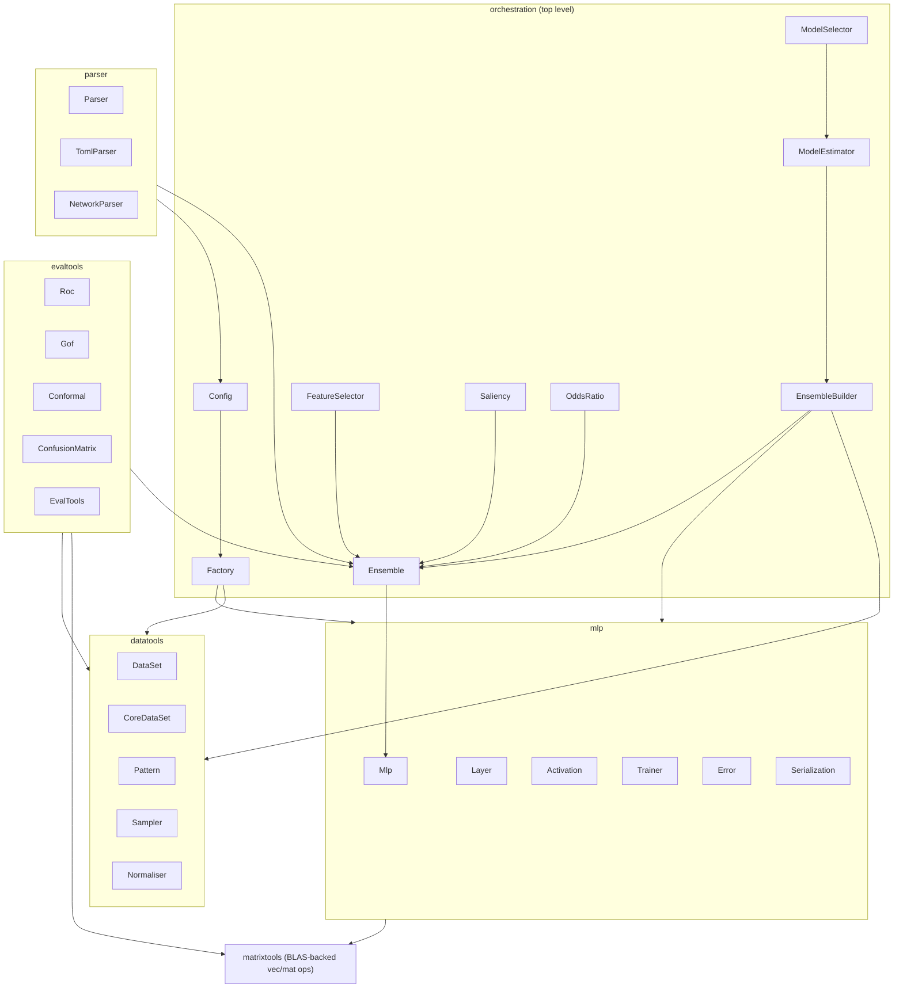
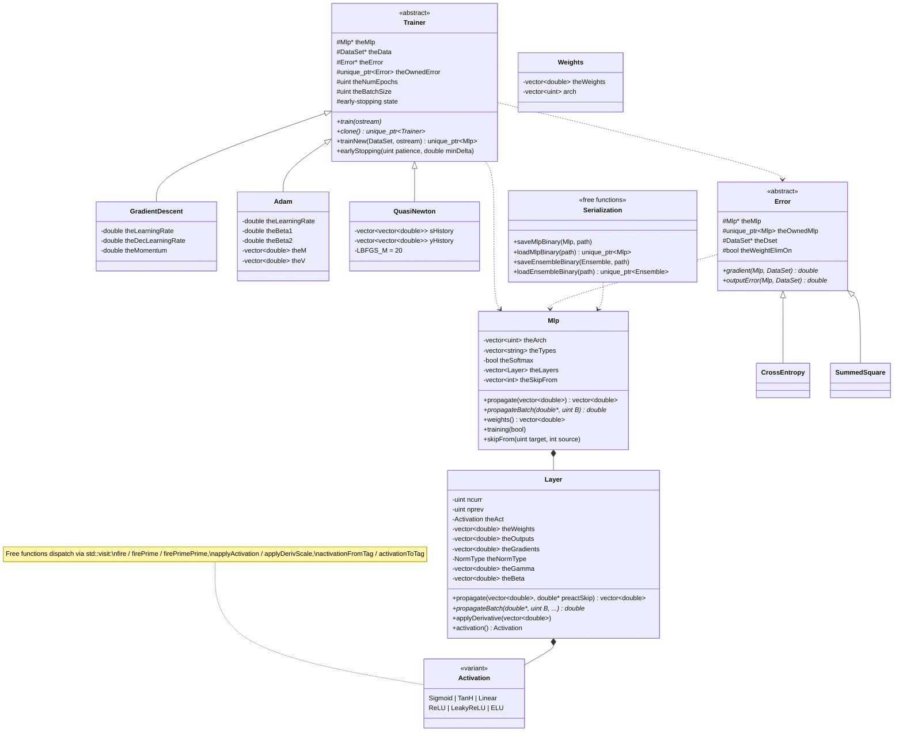
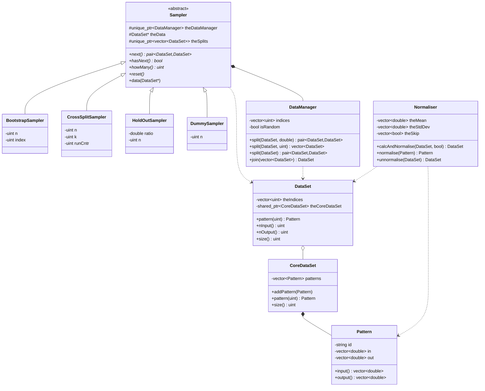
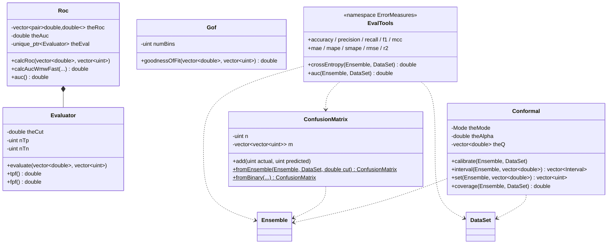
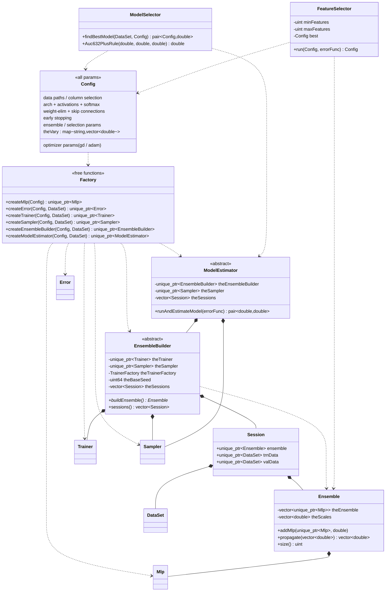
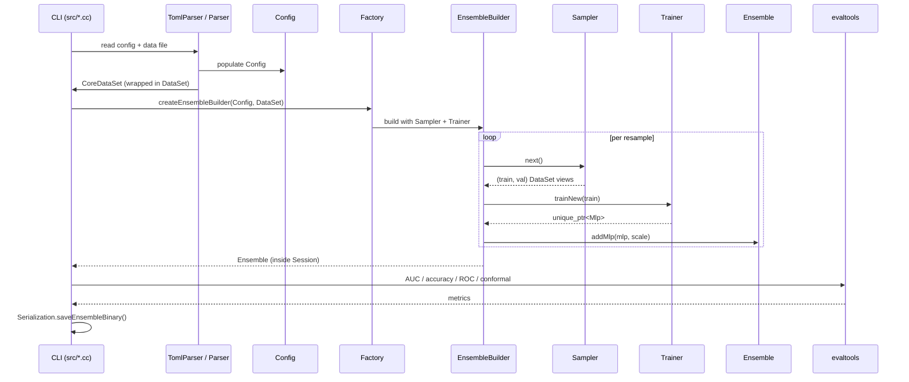

# NeuralNetHack Architecture

This document describes the current architecture of NeuralNetHack: a C++23
library for training and evaluating weighted ensembles of multi-layer
perceptrons. Diagrams are [Mermaid](https://mermaid.js.org/) and render
directly on GitHub.

It replaces the old Umbrello/Visual-Paradigm models (`*.xmi`, `nethack.vpp`),
which predated the `std::variant` activation refactor, the Sampler hierarchy,
conformal prediction, and the Factory-based orchestration.

## Contents

- [System overview](#system-overview)
- [mlp — the MLP engine](#mlp--the-mlp-engine)
- [datatools — data handling](#datatools--data-handling)
- [evaltools — evaluation](#evaltools--evaluation)
- [Orchestration — ensembles, estimation, selection](#orchestration--ensembles-estimation-selection)
- [Training data flow](#training-data-flow)
- [CLI binaries](#cli-binaries)

## Legend

Across the class diagrams:

| Arrow | Meaning |
|---|---|
| `A <\|-- B` | B inherits from A |
| `A *-- B` | A owns B by value / `unique_ptr` (composition) |
| `A o-- B` | A shares B via `shared_ptr` (aggregation) |
| `A ..> B` | A references B without owning (raw pointer / ref / uses) |

---

## System overview

Five subsystems sit under a thin orchestration layer. Arrows point in the
direction of the dependency (caller to callee).

---

## mlp — the MLP engine

The core engine. An `Mlp` is a sequence of `Layer`s held **by value**; each
`Layer` carries its activation as a `std::variant` tag (no class hierarchy,
no virtual dispatch on the hot path). `Trainer` and `Error` are the only
polymorphic hierarchies here.

Notes:

- **Activation devirtualized.** `Layer` holds one `Activation` variant by
  value; both scalar and batch paths dispatch through `std::visit`, letting
  the compiler inline the per-element kernel. Parameterized activations carry
  their own params (`LeakyReLU::alpha = 0.01`, `ELU::alpha = 1.0`).
- **Layers do more than activation.** Each `Layer` also holds optional batch
  / layer normalization state (`NormType`, gamma/beta + running stats),
  inverted-dropout buffers, and weight-init scheme. Skip connections are
  recorded per target layer in `Mlp::theSkipFrom` (-1 = none).
- **Ownership is flexible at the Trainer/Error seam.** Both default to raw
  non-owning pointers to their collaborators, but each also has an *owning*
  constructor (`Trainer` can own its `Error`; `Error` can own its `Mlp`)
  used when a trainer must outlive the caller's stack frame.
- **`trainNew()` returns `unique_ptr<Mlp>`** — the trained net is freshly
  owned by the caller (typically `EnsembleBuilder`).

---

## datatools — data handling

Pattern storage is shared and copy-free: many `DataSet` index-views point
into one `CoreDataSet` via `shared_ptr`. `Sampler` is the resampling
hierarchy that drives ensemble training and model estimation.

Notes:

- **`DataSet` is a lightweight view.** It owns only an index vector plus a
  `shared_ptr<CoreDataSet>`. Splits produced by `DataManager` are new views
  over the same underlying patterns — no pattern copying.
- **`Sampler::next()`** yields a `(train, test/validation)` pair per call;
  `hasNext()`/`howMany()`/`reset()` drive the resampling loop. The concrete
  type fixes the resampling scheme (bootstrap, k-fold cross-split, hold-out,
  or dummy pass-through).
- **`Normaliser`** caches per-feature mean/stddev and a skip mask (binary
  features are left untouched), and normalizes in place bidirectionally.

---

## evaltools — evaluation

Mostly stateless calculators plus a metrics namespace. Conformal prediction
and the confusion-matrix metrics are the recent additions absent from the old
design model.

Notes:

- **`Roc`** computes the ROC curve and AUC three ways
  (Wilcoxon-Mann-Whitney, a fast WMW variant, and trapezoidal); it owns an
  `Evaluator` for the threshold sweep.
- **`Conformal`** does split-conformal prediction: per-dimension residual
  quantiles for regression intervals, LAC scores for classification sets,
  plus an empirical `coverage()` check. It consumes an `Ensemble` + a
  calibration `DataSet`, owning neither.
- **`EvalTools::ErrorMeasures`** is the one-stop metrics namespace, with
  overloads taking either raw vectors or an `(Ensemble, DataSet)` pair, plus
  the confusion-matrix-derived classification metrics.

---

## Orchestration — ensembles, estimation, selection

`Config` is reflected by `Factory` into the polymorphic object graph. An
`EnsembleBuilder` drives a `Sampler` + `Trainer` to populate an `Ensemble`;
`ModelEstimator` wraps that with cross-validation/bootstrap error estimation;
`ModelSelector` grid-searches over `Config`. Results travel as `Session`s.

Notes:

- **`Ensemble`** owns its members as `vector<unique_ptr<Mlp>>` with a parallel
  `theScales` vector; `propagate()` returns the scale-weighted average of
  member outputs.
- **`Session`** bundles a built `Ensemble` with the train/validation `DataSet`
  views it was produced from; it is the unit of result passed up the stack and
  out to `PrintUtils`.
- **`EnsembleBuilder`** can train members in parallel: `theTrainerFactory`
  hands each worker its own `Trainer`, and `nnh::rand` (thread-local
  `mt19937_64`, seeded from `theBaseSeed`) gives each worker an independent
  RNG stream.
- **`Saliency`** and **`OddsRatio`** (free-function namespaces, not shown as
  classes) compute input-sensitivity and binary-classification feature impact
  over an `Ensemble`.

---

## Training data flow

End-to-end path from a config file to a saved, evaluated ensemble.

For model selection the same flow nests one level deeper: `ModelSelector`
sweeps `Config.theVary`, and for each variant a `ModelEstimator` runs the
resampling loop above to produce a cross-validated error estimate, scored with
the `.632+` rule.

---

## CLI binaries

`src/` builds the user-facing executables on top of the library:

| Binary | Source | Role |
|---|---|---|
| `neuralnethack` | `neuralnethack.cc` | Main driver: train + estimate from a config file |
| `ann` | `ann.cc` | Train/apply a single network |
| `modelselector` | `modelselector.cc` | Grid search over hyperparameters |
| `featureselector` | `featureselector.cc` | Backward-elimination feature selection |
| `featureselector2` | `featureselector2.cc` | Variant feature-selection driver |
| `auc` | `auc.cc` | Compute ROC/AUC for predictions |
| `saliency` | `saliency.cc` | Input-sensitivity analysis |

---

## Maintaining this document

These diagrams are hand-maintained Mermaid, kept in sync with the headers.
When you change ownership, inheritance, or add a class, update the relevant
diagram here. There is no generator and no binary model file to regenerate.
